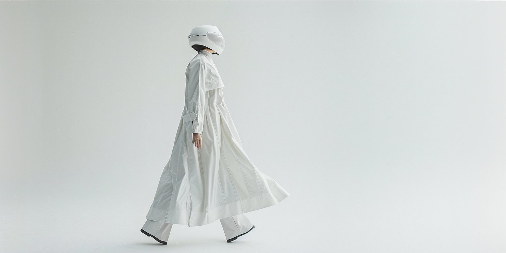

# ECHO.11

### Decoding the Algorithm of Human Resilience

*Bridging Consumer Psychology and Generative AI to build future-proof brands.*

---

## About

**ECHO.11** is a digital laboratory exploring the intersection of consumer psychology and generative AI. Created by [Shira Sarid](https://linkedin.com/in/shirasarid), it's a curated space for "Quiet Branding" and strategic foresight.

> *"In an age of artificial intelligence, our most powerful tool remains the human mind."*

## What You'll Find Here

- **Neuro-Aesthetics** — How visual design impacts cognitive load
- **2026 Design Forecast** — Where generative art is heading
- **Future-Proof Skills** — Capabilities for the changing job market
- **Calm AI** — Creating digital spaces that feel human

## Tech Stack

- HTML5 / CSS3 / Vanilla JavaScript
- Hosted on [Vercel](https://vercel.com)
- Typography: [Outfit](https://fonts.google.com/specimen/Outfit) + [Space Mono](https://fonts.google.com/specimen/Space+Mono)
- Google Analytics 4 (GA4)

## Features

- ⏰ Live digital clock
- 📱 Fully responsive
- ♿ Accessibility-first (WCAG compliant)
- 🎭 Scroll reveal animations
- 🍔 Side navigation menu
- 📊 Real-time User Tracking with GA4

## Connect

---

**Psychology First, Pixels Second.**

*Built with 🖤 by Shira Sarid × Claude*

